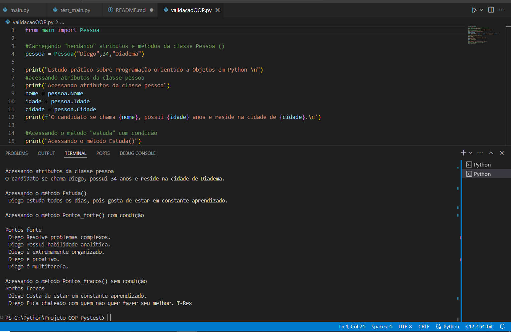
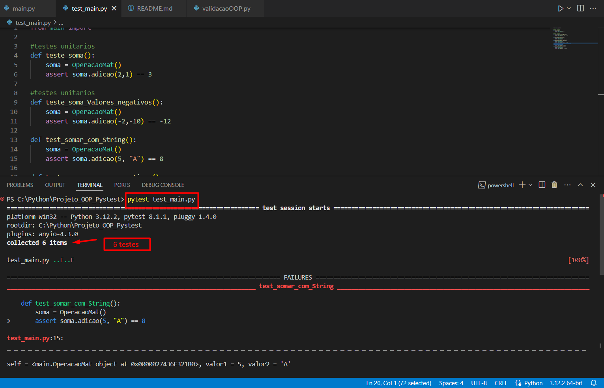
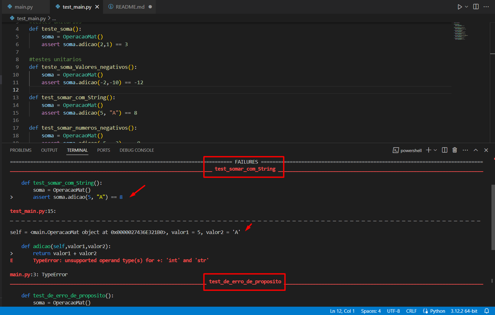
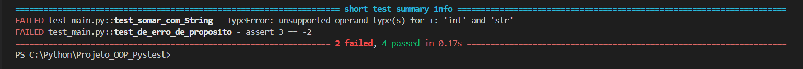

# Estudo Prático de Programação Orientada a Objetos em Python e testes unitários com Pytest

Este repositório contém um estudo prático de Programação Orientada a Objetos (OOP) em Python, acompanhado de testes unitários intuitivos utilizando o Pytest.

## Descrição

O estudo aborda os conceitos fundamentais de OOP em Python, demonstrando sua aplicação através de exemplos práticos. Além disso, são apresentados testes unitários para validar o funcionamento correto do código.

## Arquivos

### main.py

Contém as implementações das classes `OperacaoMat` e `Pessoa`, que representam operações matemáticas simples e informações de uma pessoa, respectivamente.

### validacaoOOP.py

Demonstra o uso das classes definidas em `main.py` através de exemplos de criação de instâncias, acesso a atributos e chamada de métodos.



### test_main.py

Contém os testes unitários para validar o comportamento das funções definidas em `main.py`.

## Como Usar

1. **Clone este repositório:**

    ```bash
    git clone https://github.com/Dxis/Estudo-OOP-Python-Pytest.git
    ```

2. **Instale as dependências:**

    ```bash
    pip install pytest
    ```


Para executar os exemplos e os testes unitários, siga as instruções abaixo:

1. Certifique-se de ter o Python instalado em seu sistema.
2. No terminal, navegue até o diretório do projeto.
3. Execute o seguinte comando para executar os exemplos e testes:

```bash
pytest test_main.py

```

### Execução Pytest 

#### test session starts


#### FAILURES


#### short test summary info



## Contribuição

Contribuições são bem-vindas! Sinta-se à vontade para abrir uma issue ou enviar um pull request.

## Licença

Este projeto é distribuído sob a licença MIT. Consulte o arquivo `LICENSE` para obter mais detalhes.

